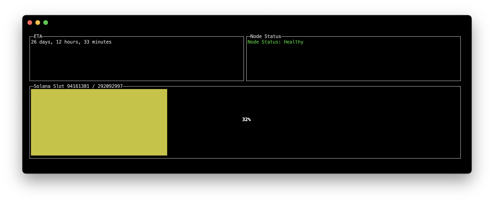

# Node Monitor

This program is designed to monitor the progress of your Blazing Fast SVM Ephemeral Validator based on [magicblocklabs/validator](https://hub.docker.com/r/magicblocklabs/validator). The default image is built and available at `ghcr.io/klementxv/node-monitor:latest`.




## Usage

### Using Docker Container

1. **Run the container:**

   ```bash
   docker run --rm -it --name node-monitor -e RPC_URL=http(s)://<your_RPC_URL> ghcr.io/klementxv/node-monitor:latest
   ```

   Replace `http(s)://<your_RPC_URL>` with your Solana RPC client URL.

   	Tip: If you are running this container in the same Docker network as the magicblocklabs/validator container, you can use http://CONTAINER_NAME:8899 as the RPC URL. 
      
      For example, if your validator container is named validator, use http://validator:8899 as the RPC_URL.

### Using Go Build

1. **Clone the repository:**

   ```bash
   git clone https://github.com/KlementXV/NodeMonitor.git
   cd <your-repo>
   ```

2. **Build the program:**

   ```bash
   go build -o NodeMonitor main.go
   ```

3. **Run the program:**

   ```bash
   ./NodeMonitor -rpc-url=http(s)://<your_RPC_URL>
   ```

   Or by setting the environment variable `RPC_URL`:

   ```bash
   export RPC_URL=http(s)://<your_RPC_URL>
   ./NodeMonitor
   ```

### Build Docker Image

1. **Build the image:**

   ```bash
   docker build -t node-monitor:latest .
   ```

2. **Run the container:**

   ```bash
   docker run --rm -it --name node-monitor -e RPC_URL=http(s)://<your_RPC_URL> node-monitor:latest
   ```

## Configuration

- **RPC_URL**: The Solana RPC client URL (e.g., `https://api.mainnet-beta.solana.com`). This can be provided as the `-rpc-url` parameter or via the `RPC_URL` environment variable.

   - Note: If running in the same Docker network as the magicblocklabs/validator container, you can use the container name and port 8899, e.g., http://validator:8899.